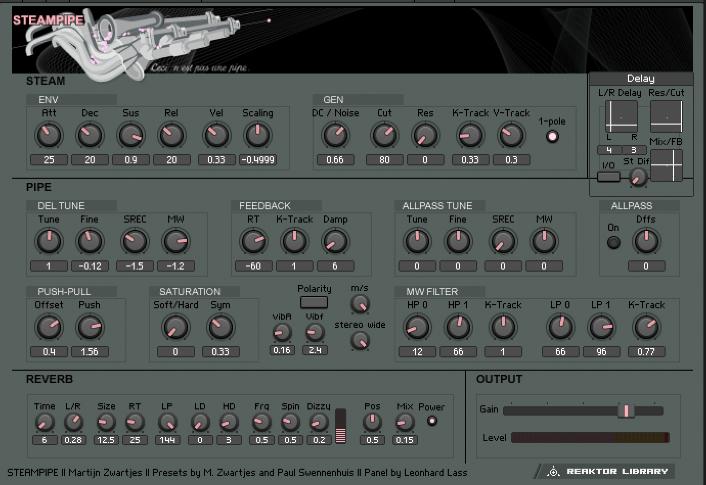

# SteamPipe: extracció funcional del patch de Reaktor

## Fonts analitzades

- `SteamPipe.ism`: instrument original de Martijn Zwartjes (2002), 1.7 MB.
- `SteamPipe_santi_2.ens`: Ensemble editable que conté el mateix instrument i l'embolcall d'entrada/sortida, 2.0 MB.
- Snapshot visible durant l'extracció: `066 Pizz`.

El format és el binari propietari `NRKT`, no un contenidor ZIP/XML i tampoc sembla xifrat. L'`.ism` conté 948 registres `KSModul`, 1.011 ports d'entrada i 896 ports de sortida. L'`.ens` conté 951 registres `KSModul`, 1.013 ports d'entrada i 896 ports de sortida. La diferència de només tres objectes i dos ports, juntament amb la repetició de noms i descripcions, indica que l'`.ens` conserva el nucli de l'`.ism` i hi afegeix l'embolcall de l'Ensemble.



## Flux principal reconstruït

```mermaid
flowchart LR
    MIDI["MIDI: pitch, gate, velocity, mod wheel"]
    ENV["Envelope\nADSR + velocity + keyboard scaling"]
    SRC["Steam generator\nDC/noise crossfade + noise filter"]
    subgraph PIPE["Pipe resonator macro"]
        TUNE["Tuned delay + sample-rate correction"]
        FB["Feedback + damping"]
        PUSH["Push–pull + polarity"]
        AP["Optional all-pass/diffusion delay"]
        SAT["Asymmetric saturation"]
        FORM["MW high-pass/low-pass formant filter"]
    end
    XFORM["Dos transformadors de senyal\nL/R, tipus encara sense nom"]
    GAIN["Master gain + level meter"]
    DLY["Filtered stereo delay"]
    REV["R66 reverb\npre-delay + diffusion + modulated late field"]
    OUT["Stereo output"]

    MIDI --> ENV
    MIDI --> SRC
    ENV --> SRC
    SRC --> TUNE
    TUNE --> FB
    FB --> PUSH
    PUSH --> TUNE
    TUNE --> AP
    AP --> SAT
    SAT --> FORM
    FORM --> XFORM
    XFORM --> GAIN
    GAIN --> DLY
    DLY --> REV
    REV --> OUT
    MIDI -. "pitch/MW tracking" .-> TUNE
    MIDI -. "MW + key tracking" .-> FORM
```



El bucle intern del `Pipe resonator` és el centre físic del model: el soroll o component DC excita un delay afinat; una part del senyal retorna amb damping, offset, saturació i polaritat configurables. No és un sampler: és un model físic basat en excitació, delay i feedback. L'ordre exterior `Steam → Pipe → Amp → Delay → R66 → Out` surt ara de la taula de connexions binària. Els dos petits mòduls entre `Pipe` i `Amp` són els objectes `2` i `802`, tots dos `Audio Voice Combiner` (tipus `442`): combinen el senyal d'àudio polifònic en una sortida monofònica abans del guany.

## Blocs i funció

| Bloc | Funció reconstruïda |
|---|---|
| Envelope | ADSR disparat pel gate MIDI. La velocitat controla la quantitat d'envolupant i el pitch escurça o allarga els temps mitjançant `Scaling`. |
| DC / Noise | Crossfade entre una component DC i soroll filtrat. És l'aire o “vapor” que excita el tub. |
| Noise filter | Cutoff i ressonància amb seguiment de nota i velocitat. `1-pole` alterna entre damping de 12 dB/oct i filtre de 24 dB/oct. |
| Delay Tune | Afina el delay principal del tub: correcció grossa, fina, compensació d'error de sample-rate i desviació per modulation wheel. |
| Feedback | `RT` regula el temps de reverberació del tub; `K-Track` el varia amb el pitch i `Damp` augmenta l'amortiment en deixar anar la tecla. |
| Push–Pull | Afegeix offset DC i controla la quantitat de vapor recirculat. Determina la interacció entre l'excitació nova i la que ja ressona dins el tub. |
| Polarity | Inverteix o conserva la fase del senyal retornat, simulant modes diferents del tub. |
| Allpass Tune / Allpass | Delay/all-pass addicional opcional. `Dffs` transforma el caràcter d'all-pass cap a difusió i accentua atacs o parcials inharmònics. |
| Saturation | Interpola entre saturació suau i clipping; `Sym` controla l'asimetria. |
| MW Filter | Dos punts de cutoff per a high-pass i low-pass. La modulation wheel interpola entre ells; cada secció té seguiment de teclat. Funciona com a model de formants/pressió. |
| Stereo wide | Decorrelació o eixamplament després del model del tub. |
| Delay | Delay estèreo en sèrie entre `Amp` i `R66`, amb temps L/R, resonància/cutoff, diferència estèreo, mix i feedback. El text intern indica que és una macro de la User Library amb un filtre afegit. |
| Reverb | Pre-delay, early diffusion i camp tardà modulat. Inclou `Size`, `RT`, damping LP/HP, `Spin`, `Dizzy`, posició i mix. |
| Output | Guany mestre i mesurador de nivell abans de la sortida estèreo. |

## Controls visibles al snapshot `066 Pizz`

| Secció | Valors visibles |
|---|---|
| ENV | Att 25; Dec 20; Sus 0.9; Rel 20; Vel 0.33; Scaling -0.4999 |
| GEN | DC/Noise 0.66; Cut 80; Res 0; K-Track 0.33; V-Track 0.3; 1-pole activat |
| DEL TUNE | Tune 1; Fine -0.12; SREC -1.5; MW -1.2 |
| FEEDBACK | RT -60; K-Track 1; Damp 6 |
| ALLPASS TUNE | Tune 0; Fine 0; SREC 0; MW 0 |
| ALLPASS | desactivat; Dffs 0 |
| PUSH–PULL | Offset 0.4; Push 1.56 |
| SATURATION | Soft/Hard 0; Sym 0.33 |
| Vibrato / width | vibA 0.16; vibf 2.4; `stereo wide` visible |
| MW FILTER | HP0 12; HP1 66; K-Track 1; LP0 66; LP1 96; K-Track 0.77 |
| REVERB | Time 6; L/R 0.28; Size 12.5; RT 25; LP 144; LD 0; HD 3; Frq 0.5; Spin 0.5; Dizzy 0.2; Pos 0.5; Mix 0.15 |

## Evidència textual recuperada del binari

Les etiquetes següents apareixen directament dins l'`.ism` i defineixen la jerarquia principal:

```text
Steam generator
Envelope
DC / Noise — Impulse Source
Pipe — Pipe resonator
Delay tuning
Sampling Rate Error Correction
Modulation Wheel Tracking
Push-Pull — Interaction
Feedback
Allpass tuning
Allpass Filter / Delay Switch
Saturation
MW Filter — Wheel controlled filter
stereo wide
Output gain
Reverb Unit
Early Diff
16Phase
Pre Delay Time
Dry/Wet
DelayS
EqualP Crossfade
Delay 4p
```

## Parser binari general i reproduïble

Resultats ja generats:

- `SteamPipe-extracted.json`: extracció completa i llegible per màquina;
- `SteamPipe-report.md`: resum humà de l'instrument;
- `SteamPipe_santi_2-report.md`: resum de l'Ensemble.

`parse_nrkt.py` llegeix directament qualsevol `.ism` o `.ens`; SteamPipe
només és el corpus amb què fem la regressió. Extreu:

- registres de classe `KSModul`, `KInPort` i `KOutPort`;
- versió, tipus numèric, ID global i offset de cada mòdul;
- nom, descripció i nombre de fills de les macros (`kind 4`);
- l'arbre complet de macros, reconstruït a partir de l'ordre preordenat del binari;
- totes les connexions de `KOutPort`, resoltes de l'índex local al mòdul destí i la seva entrada.
- el tipus de senyal, noms i textos contextuals de cada port;
- etiquetes, descripcions, rangs i resolució dels controls de panell;
- constants i snapshots amb cada valor vinculat a l'ID, tipus i camí jeràrquic;
- les Core Cell/R5X i Legacy Event Core Cells, amb el graf intern recursiu,
  propietats, constants ràpides i connexions, a més del registre base64;
- el diccionari global de tipus generat des de l'executable de Reaktor.

```bash
python3 parse_nrkt.py /Users/santiagovilanova/Desktop/SteamPipe.ism --macros-only
python3 parse_nrkt.py /Users/santiagovilanova/Desktop/SteamPipe.ism --wires
python3 parse_nrkt.py /Users/santiagovilanova/Desktop/SteamPipe.ism --dot
python3 parse_nrkt.py /Users/santiagovilanova/Desktop/SteamPipe.ism --json
python3 parse_nrkt.py patch.ens --markdown
```

El parser és només de lectura i no modifica l'original. A l'`.ism` recupera 989 connexions i a l'`.ens`, 991; en tots dos casos resol el 100% dels destins. Les dues connexions addicionals de l'Ensemble corresponen al seu embolcall. No cal capturar manualment Structure per reconstruir la jerarquia ni el cablejat.

## Abast de l'extracció

La jerarquia, el cablejat, els snapshots i els controls són extraccions binàries
deterministes. El diccionari `kind numèric → mòdul` també existeix ara i està
versionat amb el SHA-256 de Reaktor. Això elimina la necessitat de consultar
visualment Structure per a mòduls Primary i macros.

Les Core Cells ja es poden reconstruir sense consultar visualment Structure:
el parser recompon els documents segmentats i comprimits, i n'extreu nodes,
subestructures, propietats i cables. El catàleg Core associa els 90 IDs
disponibles en aquesta build amb les classes d'implementació. Els camps de
propietat encara desconeguts es conserven sense pèrdua en base64 en lloc
d'inventar-ne la semàntica. L'original no es modifica.
